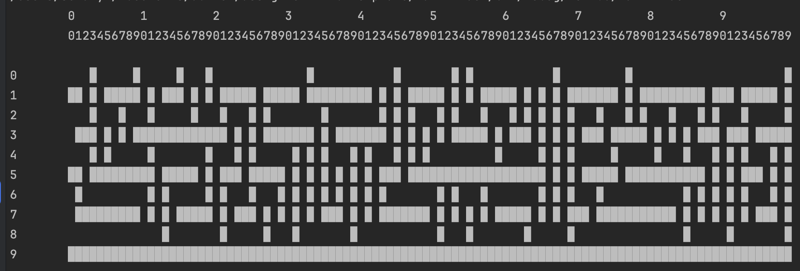
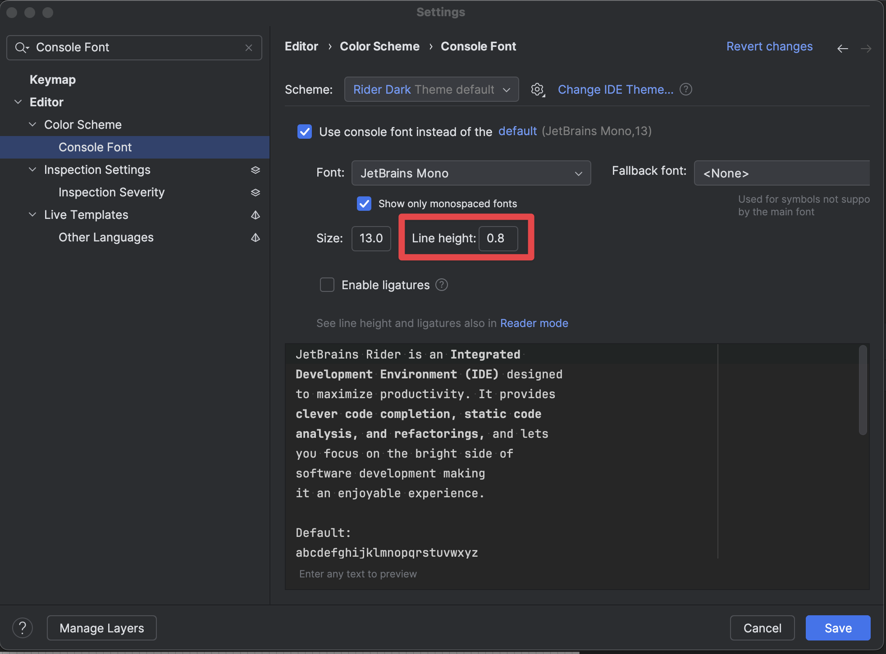
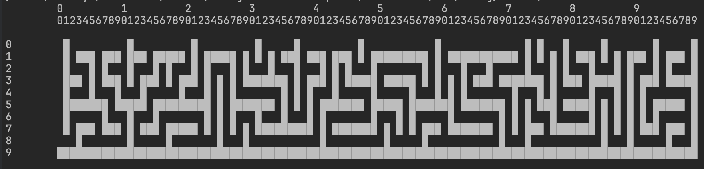
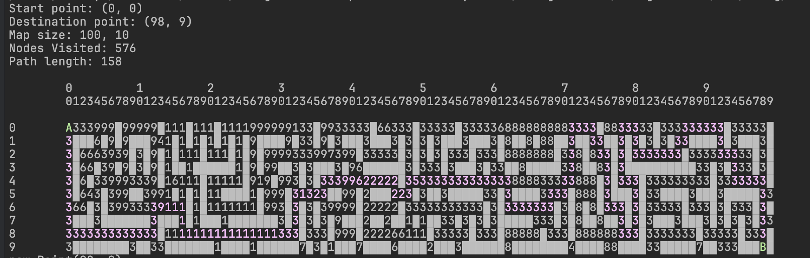

# Практична робота №2

## Doodle Maps та пошук шляхів

### Мета роботи:

Розібратись з алгоритмами пошуку шляхів A* та Дейкстри, навчитись працювати з графами заданим двомірною сіткою

## Порядок виконання

### Основне завдання

1. Передивіться файли з теки MapGeneration.
2. Почніть ваш проект з наступного шаблону коду:

```C#
using PathFinder.MapGeneration;

var optionsToGenerate = new MapGeneratorOptions()
{
    Height = 10,
    Width = 100,
};

var generator = new MapGenerator(optionsToGenerate);
string[,]? map = generator.Generate();

new MapPrinter().Print(map);

```

В цьому коді спочатку створюється об'єкт типу `MapGenerator`, при чому замість того щоб передавати велику кількість
аргументів про те яку саме карту створити, всі ці аргументи загорнуті в окремий об'єкт `MapGeneratorOptions`, по якому
зручніше бачити що ми задаємо ширину та довжину карти. Потім ми генеруємо карту, яка є просто двомірним масивом рядків,
де стінки позначені символом `█`. В останньому рядку ми створюємо ще один об'єкт - який може виводити карту на екран та
викликаємо метод для того щоб її побачити. Якщо ви все зробили правильно та запустите програму зараз, то побачите таке:



Це не дуже схоже на карту, але проблема тільки в тому що Rider за замовчуванням малює завеликі відступи між рядками в
консолі. Щоб поправити це, перейдіть у налаштування `File > Editor > Color Scheme > Console Font` а виставіть Line
Height у значення 0.8



Якщо перезапустити програму, після цього ми побачимо правильний лабіринт:



Тепер розглянемо всі варіанти параметрів, що можна задати у `MapGeneratorOptions`:

- **Width** - ширина карти у символах
- **Height** - висота карти у символах
- **Seed** - значення випадковості, за яким генерується карта. Якщо ви будете ставити його в одне і те саме число, то
  карта буде генеруватись одна і та ж. Якщо не задавати, то карта буде щоразу різна
- **Noise** - параметр від 0 до 1 який дозволяє прибрати частину стінок. Наприклад, результат при Noise = 0.3:


4. Час виконувати завдання!

   Створіть новий файл, під назвою BreadthFirstSearch в середині якого буде клас з такою ж назвою.
   Унаслідуйстесь від інтерфейсу IPathFinder, який вже є у вашому проєкті. Та в середині напишіть наступне:


```C#
using PathFinder.MapGeneration;

namespace PathFinder;

public class BreadthFirstSearch : IPathFinder
{
    public (List<Point>, int) FindPath(string[,] map, Point start, Point destination)
    {
        // write your implementation here
    }
}
```

Ця функція має приймати на вхід карту, дві точки (початкову та цільову) та повертати список з точок, що складають
найкоротший шлях за алгоритмом Пошуку в ширину, та кількість обійдених вершин. Для цього дотримуйтесь наступної логіки: "я обходитиму граф до тих пір, доки не наткнуся на точку з кординатами які я визначив/ла." Для того щоб згадати як працює Пошук в ширину, можете подивитись наступні посилання:

- [Як обійти граф за допомогою пошуку в ширину](https://www.programiz.com/dsa/graph-bfs)
- Chapter 6 в Grokking Algorithms

Після того як ви зрозумієте реалізуєте алгоритм Пошуку в ширину, ви зможете розширити його до алгоритму Дейкстри, оскільки саме останній базується на пошуку в ширину. Різниця буде лише в тому, що Дейкстра враховуватиме вартість переходу з вершини А до вершини В.

> [!NOTE]
> Для початку, можете зробити алгоритм, для якого всі ребра матимуть вагу 1.

Для того щоб вам було легше розібратись з алгоритмами Дейкстри та більш просунутим - A* залишаю вам посилання на корисні ресурси.

- [короткої статті](https://www.programiz.com/dsa/dijkstra-algorithm),
- більш розгорнутого, але трохи нудного [опису на вікі](https://en.wikipedia.org/wiki/Dijkstra%27s_algorithm).
- Chapter 7 в Grokking Algorithms
- дуже детального та [ілюстрованого гайду](https://www.redblobgames.com/pathfinding/a-star/introduction.html)

5. Для того щоб було зручно виконувати попередні пункти, почніть з модифікації методу `Print()` у `MapPrinter.cs`.
   Розширьте його так, щоб він додатково приймав список точок:

```C#
public void Print(string[,] maze, List<Point> path)
{
 // your code
}
```

При малюванні карти, зробіть так, щоб перша точка відображалась символом `А`, остання - `В`, а всі інші - крапками. Якщо
ви почнете з цього, буде значно легше дебажити всю програму, оскільки завжди буде легко виводити шлях на екран

6. Під час виконання завдання, як я зазначив вище, у вас виникне необхідність якось запам'ятовувати поточну мінімальну кількість кроків від
   початкової до певної точки, а також вершину, з якої треба прийти, щоб мати цю кількість кроків. У вас є декілька
   варіантів щоб зробити це:

а) створити два додаткових двомірних масиви для вісдстаней та точок, такої само розмірності, як і масив, який містить
граф.

```C#
  int[,] distances = new int[graph.GetLength(0), graph.GetLength(1)];
  Point[,] origins = new Point[graph.GetLength(0), graph.GetLength(1)];
```

І після цього записувати в ці масиви довжину шляху та точки відповідно:

```C#
  distances[point.Row, point.Column] = distance;
  origins[point.Row, point.Column] = origin;
```

Це простий варіант, але не надто ефективний, оскільки він потребує додатково `2n` пам'яті.

б) використати словник. Словник в C# працює так само як і в пайтоні, але потрібно обов'язково вказувати тип ключів та
тип значень:

```C#
  // declare
  var distances = new Dictionary<Point, int>();
  var origins = new Dictionary<Point, Point>();
  
  // and use
  distances[point] = distance;
  origins[point] = origin;
```

В рамках цієї лабораторної *можна* користуватися словником зі стандартної бібліотеки C#. 

7. Як відправну точку для виконання завдання можете використовувати приклад у Coloring.cs - там є робота з графом, заданим масивом рядків, є
   доставання сусідів заданої точки, є навіть пошук в ширину (нагадую, що для незважених графів порядок обходу
   алгоритмом Дейкстри перетворюється на пошук в ширину)

### Додаткове завдання

1. Додайте до параметрів генерації карти `AddTraffic` та певне число `Traffic Seed`

```C#
var generator = new MapGenerator(new MapGeneratorOptions()
{
    Height = 35,
    Width = 90,
    Noise = .1f,
    AddTraffic = true,
    TrafficSeed = 1234
});
```

Тепер при генерації карти вона містить значення заторів! До речі, затори додаються пошуком в глибину на випадкове
значення глибини та сили затору




1. Модифікуйте програму, так щоб вона враховувала затори. Вважайте, що для того щоб виїхати з точки, що містить
   значення n (від 1 до 9) потрібно їхати зі швидкістю `v=60 - (n-1)*6`км\год. Тобто, 1 - 60 км\год, а 9 - 12 км\год.
   Після виведення шляху напишіть сумарний час поїздки. (відстань з точки A в точку В дорівнює 1 км)
2. Переробіть програму на алгоритм А*, в якості еврістики рахуйте манхетенську відстань від точки до цілі (
   тобто сума клітинок по горизонталі та діагоналі), або звичайну геометричну (за теоремою Піфагора)


## Тести

Зверніть увагу: шаблон до цього асаймента містить `PathFinderTests` - заздалегідь підготовані тести. Це не вичерпний набір тестів - ви можете підготувати власні, щоб відловити більше багів і спростити розробку. У будь-якому разі, сподіваємось, що ці тести будуть вам помічними.

## Додатковий матеріал

1. [Візуалізація пошуків шляхів](https://qiao.github.io/PathFinding.js/visual/)

## Контрольні питання

1. Опишіть алгоритми Дейкстри та A*, що таке еврістика і для чого вона потрібна?
2. Що таке пошук в глибину та ширину?
3. Що таке кістякове дерево та якими алгоритмами його можна шукати?
4. Яка реалізація черги з пріоритетом дозволяє зробити більш ефективну реалізацію алгоритму Дейкстри?

**Важливо**

Список "контрольних питань" - не "все, що можуть питати під час захисту". Асистенти можуть задавати будь-які питання, які стосуються теми асайменту. Ви повинні добре орієнтуватися у теорії того, що імплементували.


## Вимоги до оформлення

1. Дотримуйтесь стилю коду в своєму проєкті (1 класс - 1 файл; Назва фалу - Назва класу в середині файлу; і так далі)
2. Дотримуйтесь адекватних та зрозумілих назв гілок та комітів. Коміти по типу "-", ".", "blabla" не прийнятні. Назва коміту має відповідати роботі проробленій у ньому.
4. Також будь ласка, дотримуйтесь структури проєкту, не створюйте пусті файли, пусті класи, пусті методи.
5. Також, **НАЙГОЛОВНІШЕ** - ви маєте розбиратись в коді та бути здатним пояснити його асистентові

За недотримання цих правил, ваша оцінка може бути знижена!

## Оцінювання

**Максимальний бал - 13 (+4 можливих додаткових бали):**
- реалізація алгоритму пошуку найкоротших шляхів (без заторів) - 3 бали;
- відповіді на теоретичні питання - 3 бали;
- виконання додаткового практичного завдання при здачі - 3 бали;
- реалізація заторів (+ пошук найкоротшого шляху через Дейкстру) - 4 бали

**Додаткові завдання:**
- реалізація A* (для пошуку найкоротших шляхів у заторах) - +2 бали
- просунута візуалізація процесу/прогресу виконання A* - +2 бали
  - Тут можете придумати будь-який спосіб візуалізації, який би був зручним для розуміння (не просто виводити координати). Для візуалізації у консолі може стати у нагоді бібліотека накшталт CursesSharp або подібні. Алтернативно можете познайомитися з бібліотеками для віконної графіки. 

**Примітки**
- Зверніть увагу, що завдання "реалізація заторів" та "реалізація A*" передбачають написання **власної** черги з пріоритетом (на основі купи). Без цієї вимоги за відповідні завдання можна отримати лише частину балів.
- У цьому завданні можна користуватися вбудованими `List`/`ArrayList` (але не решту структур даних). 
